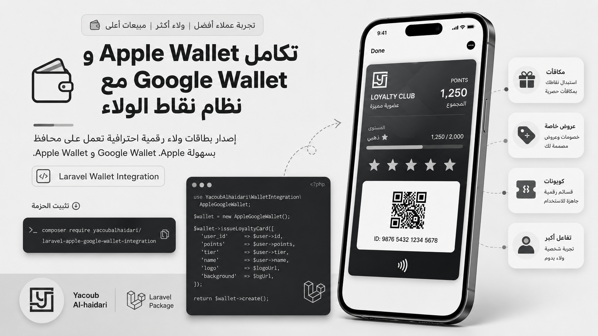

# Laravel Apple & Google Wallet Integration



Laravel package for generating **Apple Wallet** loyalty passes in `.pkpass` format and **Google Wallet** save links, with stamp-card support and stamp image generation for both platforms.

**Author:** [Yacoub Alhaidari](https://yacoubalhaidari.com)

## Contents

- [Features](#features)
- [Requirements](#requirements)
- [Installation](#installation)
- [Quick Setup](#quick-setup)
- [Wallet Design Studio](#wallet-design-studio)
- [Usage](#usage)
- [Extensibility](#extensibility)
- [Docs](#docs)
- [Localization](#localization)
- [License](#license)

## Features

- Generate **Apple Wallet** passes as `.pkpass` files.
- Create **Google Wallet** save links with JWT.
- Create or update Google Loyalty Class/Object data.
- Stamp-card support with a GD-based image generator.
- DTO-first API without a direct Eloquent dependency.
- Swappable builders for Apple and Google pass definitions.
- Events fired before pass definitions are built.
- English is the default documentation language.
- Local **Wallet Design Studio** for previewing and exporting settings.

## Requirements

| Requirement | Details                                         |
| ----------- | ----------------------------------------------- |
| PHP         | 8.2 or newer                                    |
| Laravel     | 11 or 12                                        |
| Extensions  | `openssl`, `zip`, `gd`                          |
| Apple       | Pass Type ID + `.p12` certificate + WWDR `.pem` |
| Google      | Service Account JSON + Issuer ID                |

## Installation

```bash
composer require yacoubalhaidari/laravel-apple-google-wallet-integration
```

Publish the config and language files when needed:

```bash
php artisan vendor:publish --tag=apple-google-wallet-config
php artisan vendor:publish --tag=apple-google-wallet-lang
php artisan storage:link
```

## Quick Setup

Place the Apple certificates in `storage/app/apple-wallet/` and the Google Service Account file in `storage/app/google-wallet/`, then set the core values in `.env`:

```env
APP_URL=https://example.com
WALLET_LOCALE=en

APPLE_WALLET_PASS_TYPE_IDENTIFIER=pass.com.example.yourapp
APPLE_WALLET_TEAM_IDENTIFIER=XXXXXXXXXX
APPLE_WALLET_ORGANIZATION_NAME="Your Brand"
APPLE_WALLET_CERTIFICATE_PATH=storage/app/apple-wallet/pass.p12
APPLE_WALLET_CERTIFICATE_PASS=your-p12-password
APPLE_WALLET_WWDR_CERTIFICATE=storage/app/apple-wallet/AppleWWDRCAG6.pem
APPLE_WALLET_ICON_PATH=public/images/logo.png
APPLE_WALLET_LOGO_PATH=public/images/logo.png

GOOGLE_WALLET_ISSUER_ID=3388000000000000000
GOOGLE_WALLET_SERVICE_ACCOUNT_JSON=storage/app/google-wallet/service-account.json
GOOGLE_WALLET_ISSUER_NAME="Your Brand"
GOOGLE_WALLET_DEFAULT_LOGO=https://example.com/images/logo.png
GOOGLE_WALLET_FALLBACK_LOGO=https://example.com/images/logo.png
GOOGLE_WALLET_PUBLIC_ASSET_BASE_URL=https://example.com
```

Optional stamp settings:

```env
APPLE_WALLET_STAMP_COMPLETED_ICON=public/images/stamps/completed.png
APPLE_WALLET_STAMP_EMPTY_ICON=public/images/stamps/empty.png
APPLE_WALLET_STRIP_BG_IMAGE=/images/stamps/STAMP_BG.png

GOOGLE_WALLET_STAMP_COMPLETED_ICON=public/images/stamps/completed.png
GOOGLE_WALLET_STAMP_EMPTY_ICON=public/images/stamps/empty.png
GOOGLE_WALLET_STAMP_STRIP_BG_IMAGE=/images/stamps/STAMP_BG.jpeg
```

Inspect the current setup from Tinker:

```php
app(\Yacoubalhaidari\AppleGoogleWallet\Apple\AppleWalletService::class)->configurationReport();
app(\Yacoubalhaidari\AppleGoogleWallet\Google\GoogleWalletService::class)->configurationReport();
```

## Wallet Design Studio

The studio runs automatically in `local` and can be opened at:

```text
http://your-app.test/wallet-studio
```

You can change the route or enable it from `.env`:

```env
WALLET_STUDIO_ENABLED=true
WALLET_STUDIO_ROUTE=wallet-studio
```

It helps preview colors and layout, upload icons, generate previews, export `.env` settings, and test sample card creation.

## Usage

### Prepare DTOs

```php
use Yacoubalhaidari\AppleGoogleWallet\DTOs\LoyaltyProgramData;
use Yacoubalhaidari\AppleGoogleWallet\DTOs\MemberCardData;

$program = LoyaltyProgramData::fromArray([
    'id' => $card->id,
    'name' => $card->name,
    'required_stamps' => $card->required_stamps,
    'reward_count' => $card->reward_count,
    'logo_path' => public_path('images/logo.png'),
    'image_url' => asset('images/logo.png'),
]);

$member = MemberCardData::fromArray([
    'id' => $userCard->id,
    'qr_code' => $userCard->qr_code,
    'stamps_progress' => $userCard->stamps_progress,
    'rewards_earned' => $userCard->rewards_earned,
    'is_completed' => $userCard->is_completed,
    'member_name' => trim($user->first_name . ' ' . $user->last_name),
]);
```

### Apple Wallet

```php
use Yacoubalhaidari\AppleGoogleWallet\Facades\AppleWallet;

$pkpass = AppleWallet::createPass($program, $member);

return response($pkpass, 200, [
    'Content-Type' => 'application/vnd.apple.pkpass',
    'Content-Disposition' => 'attachment; filename="loyalty.pkpass"',
]);
```

### Google Wallet

```php
use Yacoubalhaidari\AppleGoogleWallet\Facades\GoogleWallet;

$saveUrl = GoogleWallet::saveUrl($program, $member);

GoogleWallet::updateLoyaltyCard($program, $member);
```

## Extensibility

You can replace the default builders from the config files:

```php
// config/apple-wallet.php
'pass_definition_builder' => App\Wallet\CustomApplePassBuilder::class,

// config/google-wallet.php
'payload_builder' => App\Wallet\CustomGooglePayloadBuilder::class,
```

Available events:

```php
Yacoubalhaidari\AppleGoogleWallet\Events\ApplePassDefinitionBuilding::class
Yacoubalhaidari\AppleGoogleWallet\Events\GoogleLoyaltyObjectBuilding::class
```

## Docs

| File                                                 | Content                                     |
| ---------------------------------------------------- | ------------------------------------------- |
| [docs/apple-wallet.md](docs/apple-wallet.md)         | Apple Wallet setup, certificates, and usage |
| [docs/google-wallet.md](docs/google-wallet.md)       | Google Wallet setup and Service Account     |
| [docs/README.md](docs/README.md)                     | Documentation index                         |
| [README.ar.md](README.ar.md)                         | Arabic overview for the package             |
| [config/apple-wallet.php](config/apple-wallet.php)   | Apple Wallet options                        |
| [config/google-wallet.php](config/google-wallet.php) | Google Wallet options                       |
| [config/studio.php](config/studio.php)               | Wallet Design Studio options                |

## Localization

The default locale can be set with:

```env
WALLET_LOCALE=en
```

Use translations like this:

```php
wallet_trans('stamps');
```

To publish the language files:

```bash
php artisan vendor:publish --tag=apple-google-wallet-lang
```

## License

MIT - Yacoub Alhaidari
